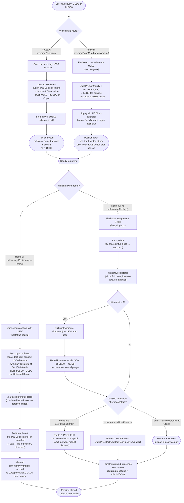
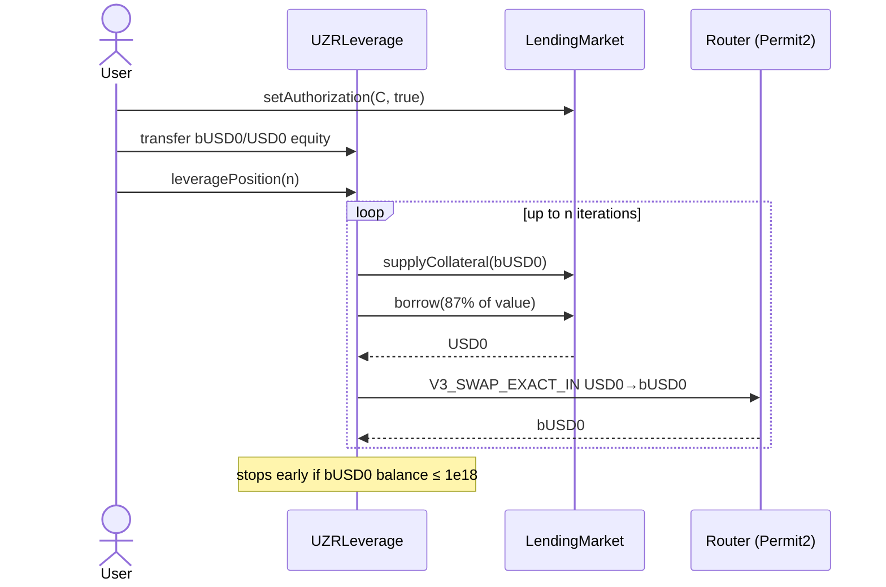
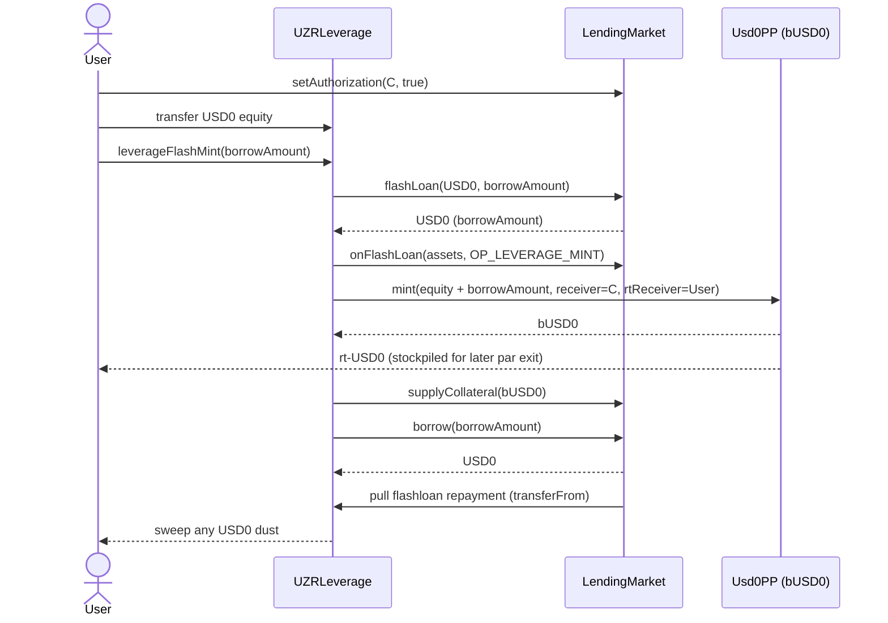
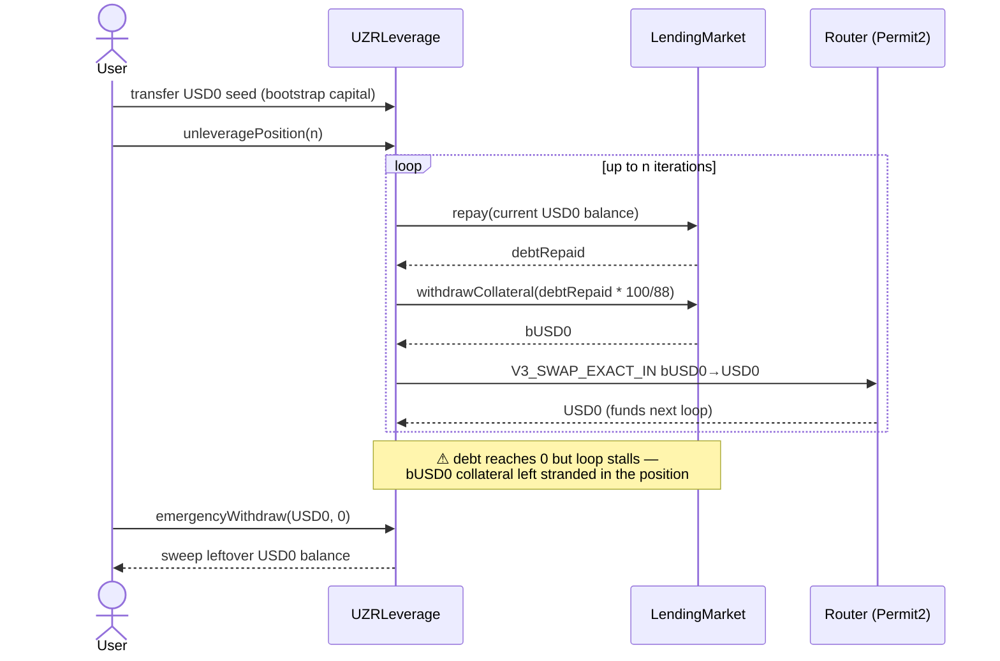
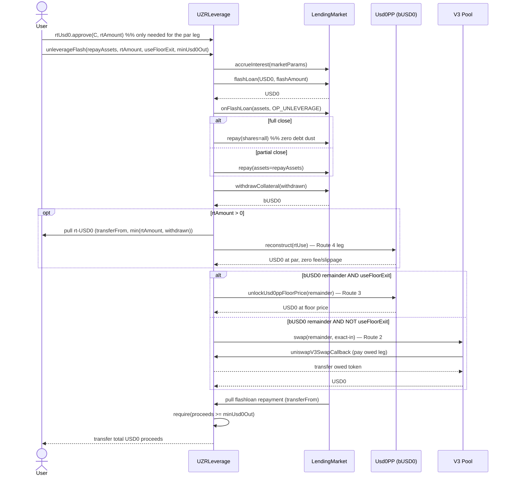
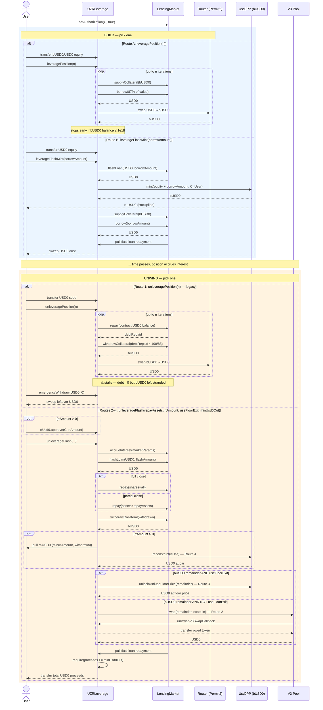

# UZRLeverage Contract

## ⚠️ DISCLAIMER

**EXPERIMENTAL SOFTWARE - USE AT YOUR OWN RISK**

This software is experimental and has not been audited. It is provided "as is" without warranty of any kind. Use of this software may result in financial loss. The authors and contributors are not responsible for any losses, damages, or liabilities that may arise from the use of this software. **You use this software at your own risk.**

## Overview

The `UZRLeverage` contract enables recursive leverage and deleverage operations on the UZR Lending Market. It automates the process of supplying collateral, borrowing assets, and swapping between BUSD0 (collateral) and USD0 (loan token) using Uniswap Universal Router V4 to amplify or reduce leverage positions.

### Key Features

- **Recursive Leveraging**: Automatically performs multiple iterations of supplying collateral, borrowing, and swapping to increase leverage
- **Recursive Unleveraging**: Systematically repays debt, withdraws collateral, and swaps to reduce leverage
- **User Management**: Two-step user change process with pending user confirmation
- **Emergency Withdraw**: Allows users to withdraw remaining tokens from the contract
- **Slippage Protection**: Built-in slippage protection for Uniswap swaps
- **Authorization-Based Security**: All operations require explicit user authorization

## Technical Architecture

### Dependencies

- **Solidity**: `^0.8.30`
- **UZR Lending Market**: Interface for lending/borrowing operations
- **Uniswap Universal Router V4**: For token swaps with Permit2 integration
- **Permit2**: Standard token approval mechanism for Uniswap operations
- **OpenZeppelin SafeERC20**: Safe token transfer operations
- **MathLib**: Custom math library for precision calculations

### Contract Constants

All protocol addresses and parameters are hardcoded as constants:

```solidity
address constant UZR_LENDING_MARKET = 0xa428723eE8ffD87088C36121d72100B43F11fb6A;
address constant BUSD0 = 0x35D8949372D46B7a3D5A56006AE77B215fc69bC0;  // Collateral token
address constant USD0 = 0x73A15FeD60Bf67631dC6cd7Bc5B6e8da8190aCF5;    // Loan token
address constant ORACLE = 0x30Da78355FcEA04D1fa34AF3c318BE203C6F2145;
address constant IRM = 0xdfCF197B0B65066183b04B88d50ACDC0C4b01385;      // Interest Rate Model
address constant WHITELIST = 0xFE7C47895eDb12a990b311Df33B90Cfea1D44c24;
address constant UNISWAP_V4_SWAP_ROUTER = 0x66a9893cC07D91D95644AEDD05D03f95e1dBA8Af;
uint24 constant POOL_FEE = 100;  // 0.01% fee tier
address constant PERMIT2_ADDRESS = 0x000000000022D473030F116dDEE9F6B43aC78BA3;
```

### Market Parameters

The contract operates on a fixed market with the following parameters:

```solidity
MarketParams({
    loanToken: USD0,              // 0x73A15FeD60Bf67631dC6cd7Bc5B6e8da8190aCF5
    collateralToken: BUSD0,       // 0x35D8949372D46B7a3D5A56006AE77B215fc69bC0
    oracle: ORACLE,               // 0x30Da78355FcEA04D1fa34AF3c318BE203C6F2145
    irm: IRM,                     // 0xdfCF197B0B65066183b04B88d50ACDC0C4b01385
    ltv: 88e16,                   // 88% Loan-to-Value ratio (0.88)
    lltv: 0.9999e18,              // Liquidation Loan-to-Value ratio (99.99%)
    whitelist: WHITELIST          // 0xFE7C47895eDb12a990b311Df33B90Cfea1D44c24
})
```

**Market ID**: `0xA597B5A36F6CC0EDE718BA58B2E23F5C747DA810BF8E299022D88123AB03340E`

## Deployment

The contract constructor takes a single parameter:

```solidity
constructor(address user_)
```

### Constructor Behavior

During deployment, the contract automatically:

1. **Sets the initial user**: Stores the user address that will control the contract
2. **Approves Lending Market**: Grants unlimited approval to the lending market for both BUSD0 and USD0
3. **Approves Permit2**: Grants unlimited ERC20 approval to Permit2 for both tokens
4. **Sets Permit2 Allowances**: Configures Permit2 allowances for the Universal Router with:
   - Maximum amount (`type(uint160).max`)
   - Maximum expiration (`type(uint48).max`)

This eliminates the need for manual token approvals after deployment.

### Example Deployment

```solidity
address user = 0xYourAddress;
UZRLeverage leverageContract = new UZRLeverage(user);
```

## Features

### 1. Leverage Position

The `leveragePosition` function executes recursive leverage operations to amplify a position.

#### Function Signature

```solidity
function leveragePosition(uint256 iterations) external
```

#### Parameters

- `iterations` (uint256): Number of leverage iterations to perform (must be > 0)

#### Execution Flow

1. **Authorization Check**: Verifies the contract is authorized by the user on the lending market
2. **Swap Existing USD0**: If the contract holds USD0, swaps it to BUSD0 first
3. **Iteration Loop**: For each iteration:
   - Checks if sufficient BUSD0 is available (> 1e18 wei minimum)
   - Supplies BUSD0 as collateral on behalf of the user
   - Calculates borrow amount: `(collateralValue * (LTV - 0.01))` (87% effective to prevent edge cases)
   - Borrows USD0 from the lending market
   - Swaps borrowed USD0 for BUSD0 on Uniswap
   - Continues with the newly acquired BUSD0

#### Technical Details

- **Borrow Calculation**: Uses oracle price to convert collateral amount to value, then applies LTV with a 1% buffer
- **Early Termination**: Stops if BUSD0 balance falls below 1e18 wei
- **Slippage Protection**: Swaps include 0.5% minimum output protection (`amountIn * 995 / 1000`)
- **Swap Path**: `USD0 -> BUSD0` through Uniswap V3 pool with 0.01% fee tier
- **Deadline**: 5 minutes from current block timestamp

#### Example Usage

```solidity
// Transfer BUSD0 or USD0 to the contract first
IERC20(busd0).transfer(address(leverageContract), amount);

// Authorize the contract
lendingMarket.setAuthorization(address(leverageContract), true);

// Execute 3 leverage iterations
leverageContract.leveragePosition(3);
```

### 2. Mint-Based Leverage (Flash)

The `leverageFlashMint` function builds the position in a single transaction using the lending
market's free flashloan and `Usd0PP.mint` (1 USD0 -> 1 bUSD0 + 1 rt-USD0 at par).

#### Function Signature

```solidity
function leverageFlashMint(uint256 borrowAmount) external
```

#### Parameters

- `borrowAmount` (uint256): USD0 to flashloan and leave borrowed. The borrow reverts if it
  violates the market LTV; sizing rule: `borrowAmount <= 0.87 * (equity + borrowAmount)`
  (about 6.7x on equity).

#### Execution Flow

1. Flashloans `borrowAmount` USD0 from the lending market (free)
2. Mints `equity + borrowAmount` bUSD0 (to the contract) + rt-USD0 (**to the user's wallet**)
3. Supplies all bUSD0 as collateral, borrows `borrowAmount` USD0 to repay the flashloan

#### Trade-off vs `leveragePosition`

- Pool-buy loop: bUSD0 bought at the market discount (more collateral per USD0), but the
  discount is paid back with slippage when selling on close.
- Mint route: par entry (less collateral per USD0), but the rt-USD0 stockpile lets
  `unleverageFlash` later exit the same amount at par via `reconstruct` — the full round trip
  pays no pool fee or slippage.
- Reverts after bond maturity (`Usd0PP.mint` guard).

### Legacy Iterative Unleverage (`unleveragePosition`)

Pre-flashloan unwind path, kept in the contract as a comparison baseline against
`unleverageFlash`. Needs an upfront USD0 seed transferred into the contract; each loop repays
debt from the contract's current USD0 balance, withdraws collateral at a flat `100/88` ratio,
and sells it back to USD0 on the pool via the Universal Router — the proceeds fund the next loop.

```solidity
function unleveragePosition(uint256 iterations) external
```

- `iterations` (uint256): loop count (must be > 0)

**Confirmed by fork test** (`test_Unwind_LegacyIterative`, `UZRPositionSimulationFork.t.sol`):
against two real on-chain positions, the loop clears debt to zero but **stalls with collateral
still stranded** in the position — ~11% of collateral left open on an 86k bUSD0 position, ~40%
on a 27k bUSD0 position, identical remainder whether capped at 50 or 300 iterations (a structural
stall, not an iteration-count shortfall). Proceeds also land ~22–25% of equity short of the
`unleverageFlash` par/reconstruct route on the same positions. No `minUsd0Out`, no floor-price
option, and requires manually sweeping any leftover contract balance via `emergencyWithdraw`.

### 3. Unleverage Position (Flash Unwind)

The `unleverageFlash` function unwinds the position — fully or partially — in a single
transaction: flashloan USD0, repay debt, withdraw collateral, convert bUSD0 back to USD0, and
send the proceeds to the user.

#### Function Signature

```solidity
function unleverageFlash(uint256 repayAssets, uint256 rtAmount, bool useFloorExit, uint256 minUsd0Out) external
```

#### Parameters

- `repayAssets` (uint256): USD0 debt to repay. Pass `type(uint256).max` (or any value >= debt)
  for a full close — it repays by shares and leaves zero debt dust.
- `rtAmount` (uint256): Max rt-USD0 to pull from the user for the par leg. Only
  `min(rtAmount, withdrawn collateral)` is pulled; the excess never leaves the user's wallet.
- `useFloorExit` (bool): If true, dispose of the remainder via `unlockUsd0ppFloorPrice`
  instead of the pool. Quote both legs with `UZRUnwindQuoter` and pick the better one.
- `minUsd0Out` (uint256): Minimum total USD0 sent to the user. Protects against pool slippage
  and manipulation — always set it from a quote.

#### Execution Flow

1. **Authorization Check** + `accrueInterest` so the debt read is exact
2. Flashloans the repay amount of USD0 from the lending market (free, repaid in the same tx)
3. Repays debt (by shares on full close; exact assets on partial)
4. Withdraws collateral: all of it on full close; on partial, an interest-aware amount that
   keeps the remaining position at the same 1% buffer under the market LTV
5. **Par leg**: pulls up to `rtAmount` rt-USD0 from the user and calls
   `Usd0PP.reconstruct(bUSD0 + rt-USD0 -> USD0)` — par, no fee, no slippage
6. **Remainder leg**: sells any remaining bUSD0 either directly on the V3 pool or via the
   Usd0PP floor price (`useFloorExit`)
7. The market pulls the flashloan repayment; all remaining USD0 goes to the user

#### Why reconstruct

bUSD0 trades below par on the pool (~0.965 at the time of writing). Selling a levered
position's full collateral at that discount costs a large share of user equity. `reconstruct`
redeems 1 bUSD0 + 1 rt-USD0 for exactly 1 USD0, so every unit of rt-USD0 the user holds
converts that unit of the unwind from a discounted market sale into a par redemption.

#### Technical Details

- **Full close**: repay-by-shares clears the debt exactly (the old iterative path left 1 wei)
- **Partial close**: withdrawal is computed from live debt (interest-aware), replacing the old
  hardcoded `100/88`
- **rt-USD0 approvals**: the user must `rtUsd0.approve(leverageContract, amount)` before
  passing `rtAmount > 0`
- **Usd0PP paused**: `reconstruct` reverts; retry with `rtAmount = 0`
- **Flashloan liquidity**: positions larger than the market's flashloanable USD0 must be
  unwound in partial chunks (`repayAssets` < debt, repeated)

#### Example Usage

```solidity
// Quote first (off-chain, via UZRUnwindQuoter)
UZRUnwindQuoter.UnwindQuote memory q = quoter.quoteUnleverage(user, type(uint256).max, rtBalance);

// Approve rt-USD0 for the par leg
rtUsd0.approve(address(leverageContract), rtBalance);

// Full close, pool exit, minOut from the quote
leverageContract.unleverageFlash(type(uint256).max, rtBalance, q.preferFloor, q.expectedUsd0Out * 995 / 1000);
```

### 4. User Management

The contract implements a two-step user change process for security.

#### Change User (Initiate)

```solidity
function changeUser(address newUser) external
```

- **Access Control**: Only current user can initiate
- **Effect**: Sets `pendingUser` to the new address
- **User Not Changed**: Current user remains unchanged until confirmation

#### Confirm Change User

```solidity
function confirmChangeUser() external
```

- **Access Control**: Only pending user can confirm
- **Effect**: 
  - Sets `user` to `pendingUser`
  - Resets `pendingUser` to `address(0)`
- **Security**: Prevents unauthorized user changes

#### Example Usage

```solidity
// Step 1: Current user initiates change
vm.prank(USER);
leverageContract.changeUser(NEW_USER);

// Step 2: New user confirms
vm.prank(NEW_USER);
leverageContract.confirmChangeUser();
```

### 5. Emergency Withdraw

Allows the user to withdraw any remaining tokens from the contract.

#### Function Signature

```solidity
function emergencyWithdraw(address token, uint256 amount) external
```

#### Parameters

- `token` (address): Token contract address to withdraw
- `amount` (uint256): Amount to withdraw (0 = withdraw all balance)

#### Access Control

- Only the current user can call this function

#### Example Usage

```solidity
// Withdraw all BUSD0
leverageContract.emergencyWithdraw(address(busd0), 0);

// Withdraw specific amount of USD0
leverageContract.emergencyWithdraw(address(usd0), 100e18);
```

### 6. Pool Fee Getter

```solidity
function poolFee() external pure returns (uint24)
```

Returns the Uniswap pool fee tier (100 = 0.01%).

## Flow Diagram

Every route the contract supports, build side and unwind side, laid out separately so each can
be traced against its function above.



**Measured outcome per route** (two real on-chain positions, `UZRPositionSimulationFork.t.sol`,
`forge test --match-path "test/UZR*.sol" -vv`):

| Route | 86k bUSD0 position | 27k bUSD0 position | Notes |
|---|---|---|---|
| 1. Legacy iterative | $8,321.62 | $3,213.27 | debt→0 but collateral stranded, N txs |
| 2. Pool exit (flash) | $8,215.63 | $3,254.07 | single tx, market discount on remainder |
| 3. Floor exit (flash) | $4,258.08 | $2,016.37 | single tx, floor price usually worse here |
| 4. Par/reconstruct (flash) | **$11,144.50** | **$4,153.20** | single tx, needs rt-USD0, zero loss vs par equity |

### Sequence Diagrams

Same six routes, shown as actor-to-actor call sequences. `Router` = Uniswap Universal Router
(Permit2 path), `Pool` = the bUSD0/USD0 V3 pool called directly (`uniswapV3SwapCallback`).

#### Route A — `leveragePosition` (recursive pool-buy loop)



#### Route B — `leverageFlashMint` (single-tx mint at par)



#### Route 1 — `unleveragePosition` (legacy iterative, no flashloan)



#### Routes 2–4 — `unleverageFlash` (pool exit / floor exit / par reconstruct)



#### All Routes — Combined

Every entry point on one timeline: build side picks Route A or B, unwind side picks Route 1
(legacy) or `unleverageFlash`, which then branches again into Routes 2/3/4 for the remainder.



## rt-USD0 Liquidity & Sourcing

The par/reconstruct leg (`unleverageFlash` Route 4, `leverageFlashMint`) depends on the user
holding rt-USD0. On-chain checks against the live token (`0x82DCA22b48B14DE38ccf83B03330120c4b8acFe9`,
`rt-bUSD0`) as of block ~25,883,866:

### Supply & holders

| Metric | Value |
|---|---|
| rt-USD0 total supply | 329,732.54 |
| rt-USD0 holders | 52 addresses |
| bUSD0 total supply (companion token, same mint) | 523,344,094.76 |
| rt-USD0 as % of bUSD0 supply | ~0.063% |
| USD0 total supply (capital pool for fresh mints) | 549,082,815.74 |
| Bond maturity (`Usd0PP.getEndTime()`) | ~649 days out (~21 months) at time of check |
| `Usd0PP.paused()` | `false` |

Only 0.063% of all outstanding bUSD0 has a live rt-USD0 counterpart — most bUSD0 in circulation
was minted before this rt leg existed or has since had its rt-USD0 reconstructed/burned back.

### DEX liquidity: none

Checked Uniswap V3 `factory.getPool()` exhaustively — RTUSD0/USD0, RTUSD0/BUSD0, RTUSD0/WETH,
across all four standard fee tiers (100/500/3000/10000): **every result is the zero address.**
No pool exists on any pair, any fee tier. Etherscan corroborates independently: no DEX pairs
listed, no price feed, no market cap. 66 `Transfer` events over the trailing ~50k blocks
(~7 days) show mint-then-forward between two recurring addresses — protocol-internal routing,
not organic secondary-market trades.

### Buy strategy: mint, not TWAP

TWAP / limit-order / DCA framing doesn't apply — there is nothing to trade into. The only
acquisition path is `Usd0PP.mint(amountUsd0, bRecipient, rRecipient)`:

- **Fixed 1:1 par**, any size: 1 USD0 in → 1 bUSD0 + 1 rt-USD0 out. No price impact, no
  slippage — it's a protocol-level bond split, not an AMM trade, so there's no curve to walk
  down and no benefit to splitting a mint into tranches for price reasons (only for gas
  amortization or hedging against `paused()` flipping mid-sequence).
- **Cost is 100% capital**, not fees: sourcing `N` rt-USD0 permanently locks `N` USD0 (until
  `reconstruct` or bond maturity) and jointly mints `N` bUSD0 that needs a home (collateral
  supply, or a sink per `_giveTargetRt` in the test suite).
- **OTC sourcing from the 52 existing holders isn't realistic at any real size.** The whale
  position from the unwind comparison above (86,080 bUSD0 collateral) would need 86,080
  rt-USD0 for a full par exit — ~26% of the *entire* circulating supply. Minting is the only
  viable route, and it's actually favorable versus a market buy: guaranteed par, zero execution
  risk, bounded only by the user's own USD0 and the ~21-month maturity window, not by market
  depth — because there is no market depth to be bounded by.

## Prerequisites

Before using the contract, users must complete the following:

### 1. Transfer Tokens to Contract

The contract needs tokens to operate. Users should transfer either:
- **BUSD0** or **USD0**: For `leveragePosition`
- **USD0**: The equity for `leverageFlashMint`

`unleverageFlash` needs no upfront transfer — the flashloan seeds the repayment. For the par
leg, the user instead approves rt-USD0:

```solidity
IERC20(rtUsd0).approve(address(leverageContract), rtAmount);
```

```solidity
// Transfer BUSD0 to contract
IERC20(busd0).transfer(address(leverageContract), amount);

// Or transfer USD0 to contract
IERC20(usd0).transfer(address(leverageContract), amount);
```

**Note**: The contract does NOT require ERC20 approvals from users. It uses Permit2 with pre-approved allowances.

### 2. Authorize Contract on Lending Market

The contract must be authorized to manage positions on behalf of the user:

```solidity
lendingMarket.setAuthorization(address(leverageContract), true);
```

**Critical**: This authorization is checked at the beginning of `leveragePosition`, `leverageFlashMint`, and `unleverageFlash`. Operations will revert if not authorized.

## Technical Implementation Details

### Swap Implementation

#### Leverage Swap (USD0 -> BUSD0)

- **Command**: `V3_SWAP_EXACT_IN`
- **Path**: `USD0 (20 bytes) + POOL_FEE (3 bytes) + BUSD0 (20 bytes)`
- **Minimum Output**: `amountIn * 995 / 1000` (0.5% slippage tolerance)
- **Payer**: Contract itself (via Permit2)
- **Recipient**: Contract address
- **Deadline**: `block.timestamp + 300` (5 minutes)

#### Unwind Conversion (BUSD0 -> USD0)

- **Par leg**: `Usd0PP.reconstruct(amount, address(this))` burns bUSD0 + the user's rt-USD0
  1:1 and releases USD0 at par — no pool, no fee, no slippage. No approvals needed (bUSD0 is
  self-burned; rt-USD0 burning is role-gated to Usd0PP, not allowance-based).
- **Remainder leg (pool)**: direct `pool.swap` on the bUSD0/USD0 V3 pool (fee 100), exact
  input, paid in the `uniswapV3SwapCallback`.
- **Remainder leg (floor)**: `Usd0PP.unlockUsd0ppFloorPrice(amount)` redeems at the floor
  price (<= 1e18) when that beats the pool execution price.
- **Slippage Protection**: a single `minUsd0Out` check on the total user proceeds, quoted
  off-chain via `UZRUnwindQuoter` (replaces the old per-swap 10% oracle tolerance).

### Borrow Calculation

During leverage iterations, the borrow amount is calculated as:

```solidity
collateralPrice = oracle.price();
collateralValue = collateralAmount * collateralPrice / ORACLE_PRICE_SCALE;
borrowAmount = collateralValue * (marketParams.ltv - 1e16) / 1e18;
```

The 1e16 subtraction (1%) provides a safety buffer to prevent potential edge cases with LTV limits.

### Withdrawal Calculation

On a full close the entire collateral is withdrawn after the shares-based repay. On a partial
unwind the released amount is interest-aware:

```solidity
requiredCollateral = borrowAfter.wDivUp(marketParams.ltv - 1e16).mulDivUp(ORACLE_PRICE_SCALE, oracle.price());
withdrawn = collateral - requiredCollateral;
```

This keeps the remaining position at the same 1% buffer under the market LTV that
`leveragePosition` borrows at, instead of the old hardcoded `debtRepaid * 100 / 88`.

## Security Considerations

### Access Control

- **User-Only Functions**: `leveragePosition`, `leverageFlashMint`, `unleverageFlash`, `emergencyWithdraw`, and `changeUser` can only be called by the current user
- **Authorization Checks**: Leverage/unleverage operations verify lending market authorization before execution
- **Callback Guards**: `onFlashLoan` (lending market only) and `uniswapV3SwapCallback` (pool only) additionally require a live flow started by this contract (transient `_inFlash` flag), so unsolicited callbacks revert
- **Two-Step User Change**: Prevents unauthorized user changes

### Slippage Protection

- **Leverage Swaps**: 0.5% minimum output protection
- **Unwind**: single `minUsd0Out` check on total proceeds, quoted via `UZRUnwindQuoter`; the par (reconstruct) leg has no slippage by construction
- **Transaction Deadlines**: Universal Router swaps include a 5-minute deadline

### Token Safety

- **SafeERC20**: All token transfers use OpenZeppelin's SafeERC20 library
- **Balance Checks**: Functions verify sufficient balances before operations
- **Early Termination**: Loops stop if insufficient tokens are available

### Interest Rate Risk

- Borrowed amounts accrue interest over time, increasing the debt position
- Users should monitor their health factor and avoid liquidation
- The contract does not include automatic liquidation protection

### Oracle Risk

- Borrow calculations and unleverage swap calculations depend on oracle prices
- Oracle manipulation or stale prices could affect calculations
- Users should verify oracle prices before large operations

## Testing

The contract includes comprehensive fork tests that verify:

- **Contract Deployment**: Correct initialization of all constants and approvals
- **Leverage Operations**: Multiple iterations with position verification
- **Unleverage Operations**: Debt repayment and collateral withdrawal
- **User Management**: Two-step user change process
- **Position Tracking**: Verification of lending market positions before and after operations
- **Prerequisites**: Checks for authorization and token balances

### Test Coverage

- `test_ContractDeployment`: Verifies all contract state variables
- `testFuzz_LeverageIterations`: Fuzz tests leverage with 1-1000 iterations
- `testFuzz_UnleverageFlash`: Builds a position and fully unwinds it in one flash transaction
- `UZRLeverageFlashUnwindFork.t.sol`: dedicated suite for `unleverageFlash` / `leverageFlashMint` — par/partial/no-rt unwinds, floor exit, partial unwind fuzz, quoter-vs-execution, callback guards
- `testFuzz_LeverageIterationTwice`: Tests sequential leverage calls
- `test_ChangeUser`: Tests user change workflow
- `test_CheckPrerequisites`: Validates setup requirements

## Important Notes

1. **Token Approvals**: The contract handles all token approvals internally. Users only need to transfer tokens and authorize the contract on the lending market.

2. **No Reentrancy Protection**: The contract does not include explicit reentrancy guards. It relies on external contract behavior and should be audited for reentrancy risks.

3. **Gas Costs**: Multiple iterations in a single transaction can be expensive. Consider gas costs when choosing iteration count.

4. **Market Liquidity**: Operations require sufficient liquidity in:
   - Lending market (for borrowing)
   - Uniswap pool (for swapping)

5. **Iteration Limits**: The contract stops early if token balances become too low (< 1e18 wei), preventing dust accumulation.

6. **Position Management**: The contract manages positions on behalf of users. Users retain full ownership but delegate management authority through authorization.

7. **Oracle Dependency**: Price calculations depend on the oracle contract. Verify oracle is functioning correctly before operations.

## Integration Example

```solidity
// 1. Deploy contract
UZRLeverage leverage = new UZRLeverage(userAddress);

// 2. User transfers tokens
IERC20(busd0).transfer(address(leverage), 1000e18);

// 3. User authorizes contract
lendingMarket.setAuthorization(address(leverage), true);

// 4. Execute leverage
leverage.leveragePosition(5);

// 5. Later, when ready to deleverage: approve rt-USD0 (if held) and unwind in one tx
IERC20(rtUsd0).approve(address(leverage), rtBalance);
leverage.unleverageFlash(type(uint256).max, rtBalance, false, minUsd0Out);

// 6. Withdraw remaining tokens if needed
leverage.emergencyWithdraw(address(busd0), 0);
leverage.emergencyWithdraw(address(usd0), 0);
```

## Test Run Report (2026-09-07)

Full fork test suite executed via `forge test -vv` against fork block `25926043`.

### Summary

| Suite | File | Tests | Passed | Failed |
|---|---|---|---|---|
| `UZRLeverageForkTest` | `test/USLLeverageFork.t.sol` | 14 | 14 | 0 |
| `UZRLeverageFlashUnwindForkTest` | `test/UZRLeverageFlashUnwindFork.t.sol` | 17 | 17 | 0 |
| `UZRPosition6564SimulationForkTest` | `test/UZRPositionSimulationFork.t.sol` | 5 | 5 | 0 |
| `UZRWhaleSimulationForkTest` | `test/UZRPositionSimulationFork.t.sol` | 5 | 5 | 0 |
| **Total** | | **41** | **41** | **0** |

Runtime: 4 suites in 2.08s (6.64s CPU time).

### Unwind Route Comparison (`UZRPositionSimulationFork.t.sol`)

The simulation tests unwind two real forked positions through four exit routes and compare proceeds against theoretical par equity. Both positions confirm the same ranking: **par (reconstruct) > legacy iterative > pool exit > floor exit**.

**Position `0x6564...bCA09`** — collateral 2,671,033 bUSD0, debt 2,255,749 USD0, equity at par 415,283 USD0, leverage 6.43x:

| Route | Proceeds (USD0) | Loss vs par | Loss (bps) |
|---|---|---|---|
| Par exit (reconstruct, rt-USD0) | 415,283 | 0 | 0 |
| Legacy iterative (`unleveragePosition`) | 327,551 | 87,732 | 2,112 |
| Pool exit (sell collateral at market) | 331,852 | 83,431 | 2,009 |
| Floor exit (`unlockUsd0ppFloorPrice`) | 201,601 | 213,682 | 5,145 |

**Position `0x8926...Bc14e`** (whale) — collateral 8,608,019 bUSD0, debt 7,493,691 USD0, equity at par 1,114,328 USD0, leverage 7.72x:

| Route | Proceeds (USD0) | Loss vs par | Loss (bps) |
|---|---|---|---|
| Par exit (reconstruct, rt-USD0) | 1,114,328 | 0 | 0 |
| Legacy iterative (`unleveragePosition`) | 852,801 | 261,526 | 2,346 |
| Pool exit (sell collateral at market) | 842,292 | 272,035 | 2,441 |
| Floor exit (`unlockUsd0ppFloorPrice`) | 425,686 | 688,641 | 6,179 |

### Takeaways

- Par exit (reconstruct via rt-USD0) always recovers 100% of par equity — it's the reference/upper bound in both fixtures.
- Legacy iterative and pool exit land close together (~20-24% loss vs par); legacy iterative edges out pool exit on the smaller position, pool exit edges out legacy iterative on the whale position — the gap narrows/reverses with size because pool slippage scales with trade size while legacy iterative's per-step dust-stall loss is roughly size-invariant.
- Floor exit is consistently worst (~51-62% loss vs par) since it prices collateral at the hard floor (0.92) rather than market/par.
- `UZRLeverageFlashUnwindFork.t.sol` corroborates the ranking directly: `test_ParBeatsPoolExit` logs par proceeds 107,165,964,393,481,937,644 wei vs pool proceeds 79,076,126,270,570,989,461 wei on its own fixture — par wins by ~35%.

## Test Rerun & Flakiness Note (2026-09-07, second run)

Re-running `forge test -vv` minutes later (same day) flipped one test: **40 passed, 1 failed** — `UZRWhaleSimulationForkTest.test_Unwind_CompareAllRoutes` reverted with `panic: arithmetic underflow or overflow (0x11)`. All other 40 tests, including the sibling `UZRPosition6564SimulationForkTest` suite, stayed green.

### Root cause

`UZRPositionSimulationFork.t.sol` calls `vm.createSelectFork(RPC_URL)` with no pinned block number (test/UZRPositionSimulationFork.t.sol:53), so every run forks the **live chain tip**. Between the two runs the tip moved from block `25926043` to `25926144`, and the "whale" fixture address (`0x8926...Bc14e`, aliased in traces as `TargetUser: 0x6120...0242c`) had real on-chain activity in between — its collateral/debt shrank drastically (equity at par dropped from 1,114,328 to 11,103 USD0).

At the new block, `legacyProceeds` (106,559) came out **larger** than `parProceeds`/`parEquity` (11,103) — the opposite of the ranking the test assumes. The comparison code performs unchecked `uint256` subtraction before validating that ordering:

```solidity
// test/UZRPositionSimulationFork.t.sol:254
console.log("vs legacy iterative (USD0)   :", _fmt(parProceeds - legacyProceeds));
```

`parProceeds - legacyProceeds` underflows (`11,103 - 106,559`), reverting before the `assertGt(parProceeds, legacyProceeds, ...)` at line 261 ever runs.

### Takeaway

The comparison logic and ranking are sound (see above), but `UZRPositionSimulationFork.t.sol` is **flaky by construction**: it depends on live-chain state for two named accounts without pinning a block or fixture snapshot, so results — and even pass/fail — can drift between runs as those accounts transact on mainnet. Fix would be to pin `vm.createSelectFork(RPC_URL, BLOCK_NUMBER)` (as the other two suites effectively do by testing against stable/controlled fixtures) or guard the diff logs with `parProceeds > legacyProceeds` checks so unexpected orderings fail with a clear assertion message instead of a raw panic.
